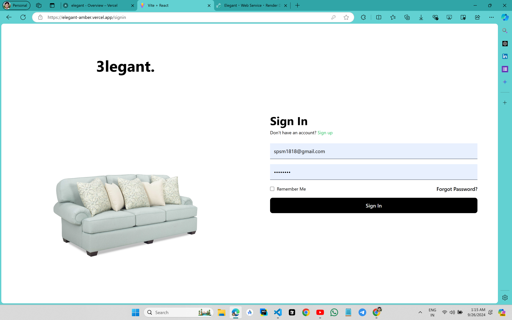
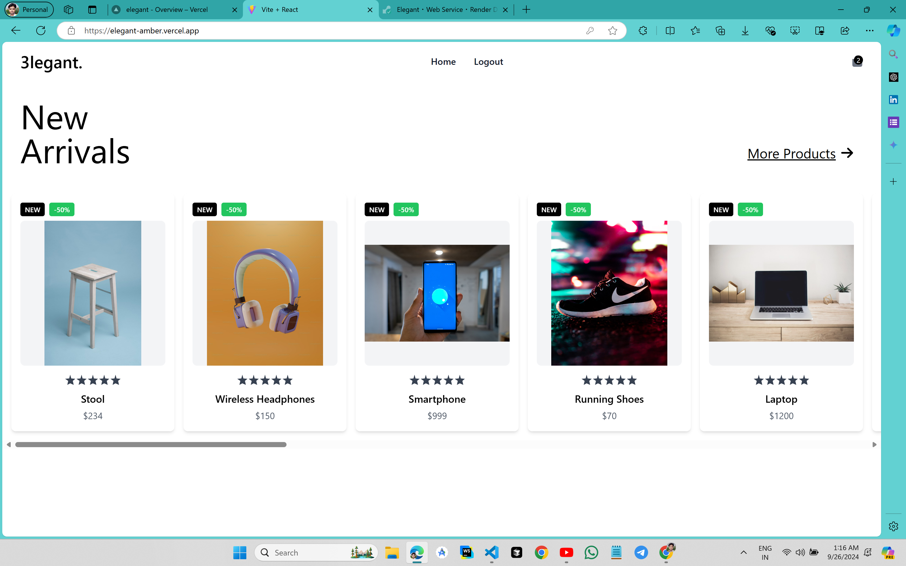
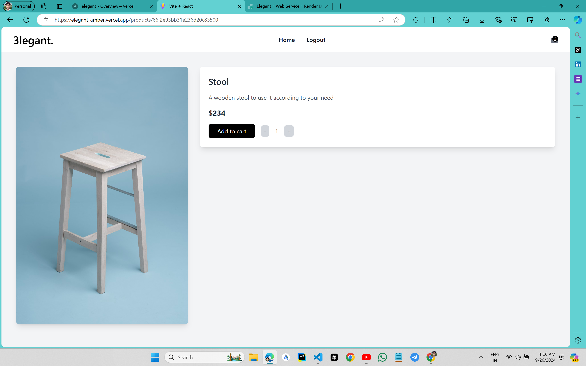
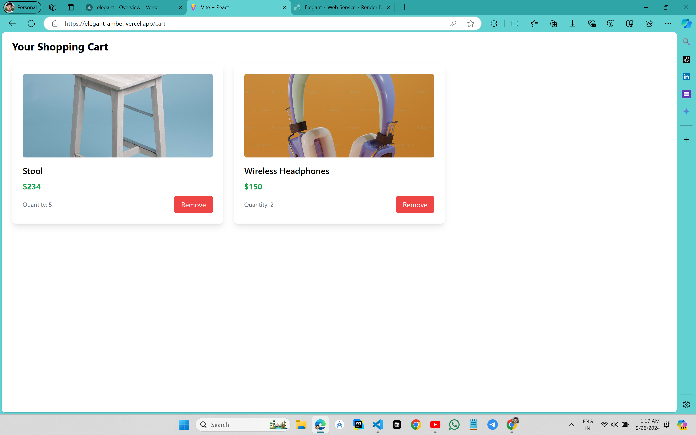

# Elegant - An E-Commerce Platform

## Overview

**Elegant** is a full-featured e-commerce platform that provides users with a seamless shopping experience. From browsing products to adding them to the cart and completing purchases, users can easily shop from a wide range of products. Built using modern web technologies, Elegant is designed to be fast, secure, and user-friendly.

#### API LINK:  [https://elegant-l61m.onrender.com](https://elegant-l61m.onrender.com)  wait for 50 seconds after login for home page.

#### LIVE WEBSITE: [https://elegant-amber.vercel.app](https://elegant-amber.vercel.app/)

---








---

## Features

- **User Authentication**: Secure user registration and login with JWT authentication.
- **Product Catalog**: Browse products by categories, view product details, and search for items.
- **Shopping Cart**: Add, update, or remove products from the shopping cart.
- **Responsive Design**: Fully responsive, providing a great experience on mobile, tablet, and desktop.

---

## Tech Stack

### Frontend:
- **React**: A JavaScript library for building user interfaces.
- **Redux Toolkit**: For efficient state management.
- **Tailwind CSS**: A utility-first CSS framework for rapid UI development.
- **Axios**: Promise-based HTTP client for API requests.

### Backend:
- **Node.js & Express**: Backend framework for building a RESTful API.
- **MongoDB**: NoSQL database to store user, product, and order information.
- **Mongoose**: ODM for MongoDB, enabling schema-based data modeling.
- **JWT**: JSON Web Tokens for secure authentication.

---

## Installation and Setup

### Prerequisites
- Node.js (v14+)
- MongoDB (v4.4+)
- Git

### Steps:

1. **Clone the Repository**:
   ```bash
   git clone https://github.com/skp3214/elegant.git
   cd elegant
   ```

2. **Install Dependencies**:
   Install both backend and frontend dependencies.
   ```bash
   # Install server dependencies
   cd backend
   npm install

   # Install client dependencies
   cd frontend
   npm install
   ```

3. **Setup Environment Variables**:
   Create a `.env` file in the `backend` directory and add your environment variables:
   ```bash
   MONGO_URI=mongodb://localhost:27017/elegant
   JWT_SECRET=your_jwt_secret
   ```

4. **Run the Application**:
   - **Backend**: 
     ```bash
     cd backend
     npm start
     ```
   - **Frontend**: 
     ```bash
     cd frontend
     npm run dev
     ```

   The backend runs on `http://localhost:5000` and the frontend runs on `http://localhost:5173`.

---

## API Endpoints

### Auth
- `POST /api/auth/register`: Register a new user.
- `POST /api/auth/login`: Login for users.
- `GET /api/auth/me`: Get the current user.

### Products
- `GET /api/products`: Get a list of all products.
- `GET /api/products/:id`: Get product details by ID.

### Cart
- `POST /api/cart`: Create or update the current user's cart.
- `GET /api/cart`: Get the current user's cart.
- `DELETE /api/cart`: Clear the user's cart.

### Orders
- `POST /api/order`: Place an order.
- `GET /api/order`: Get the order history for the current user.

---

## Usage

- **Browse Products**: Users can browse through categories, view product details, and search for products.
- **Add to Cart**: Products can be added to the cart, and quantities can be adjusted.


---

## Future Enhancements

- **Payment Gateway**: Integrate with a payment gateway (e.g., Stripe, PayPal).
- **Product Reviews**: Allow users to leave reviews and ratings for products.
- **Wishlist**: Add functionality for users to save products for later.
- **Notifications**: Implement notifications for order updates and promotions.
- **More Admin Controls**: Add features like product analytics, and user management improvements.

---

## Contributions

Contributions are welcome! Please fork the repository, create a new branch, and submit a pull request. Ensure your code follows the project's style guide.

---

## License

This project is licensed under the MIT License. See the [LICENSE](LICENSE) file for more details.

---

## Contact

For any queries or issues, feel free to contact me at:
- Email: [skprajapati3214@gmail.com](mailto:skprajapati3214@gmail.com)
- LinkedIn: [skp3214](https://www.linkedin.com/in/skp3214/)
- Twitter: [@skp3214](https://x.com/skp3214)

---
